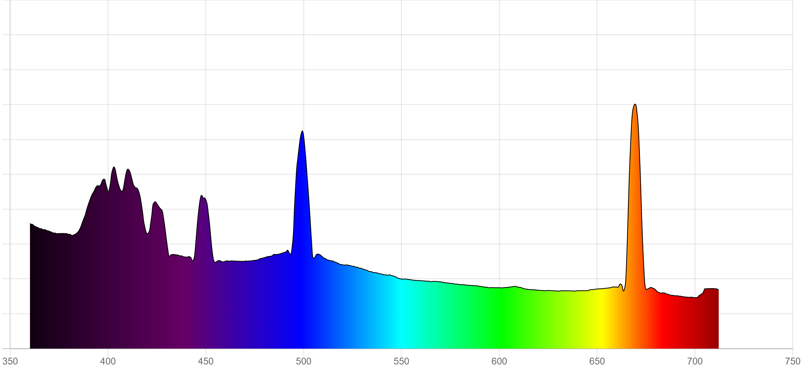

  
Instructions:  
*Installation and set up*  
**Windows**  
The application can be installed by either running the installer or by extracting and running the ZIP file.  The app can be run simply by double clicking the extracted file. 
  
**Mac**  
The application can be extracted from the ZIP file and run directly. The app can be run simply by double clicking the extracted file. 
*Connecting to camera*  
You can connect to either the computers webcam by selecting the integrated webcam option in the white box under "Video Input" in the upper left corner. Alternatively, you can use apps such as Droid Cam onto your phone and enter the URL in the white text box left of "Connect to Camera". Once this is entered correctly, you can click "Connect to Camera". 
